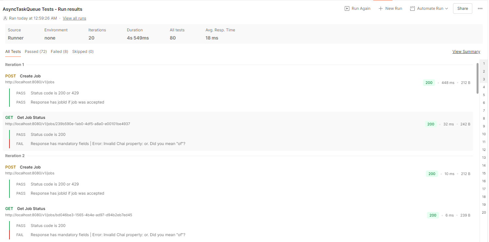
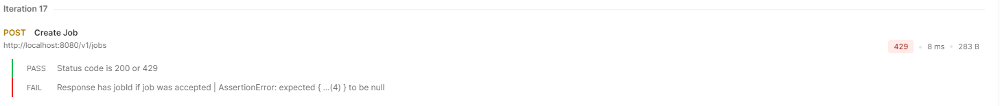

# 1. Overview

Implemented a lightweight job queue simulation API for submitting and monitoring jobs, supporting:
1. Concurrent processing with a fixed-size worker pool
2. Bounded queue to control pending jobs
3. Retry mechanism for failed jobs (max 3 retries)
4. Optional compensation framework (parked for later implementation)
5. HTTP 429 responses when the queue is full

### Main API endpoints:
| __Method__ | __Path__ |	__Description__ |
|------------|----------|-----------------|
| __POST__ | _/v1/jobs_ | Enqueues a job if capacity is available, otherwise returns 429 Too Many Requests.|
| __GET__ | _/v1/jobs/{jobId}_ | Retrieve job status and metadata.|

The implementation supports job lifecycle states and enforces queue limits for controlled testing.

# 2. Core Components
##  2.1 Data Transfer Objects (DTOs)

__JobRequest__ — captures job submission

__JobResponse__ - returns the generated Job ID for future tracking (once the job is placed in the queue)

__JobStatusResponse__ — returned from __GET__ _/v1/jobs/{jobId}_

These entities were created using Java records because they represents a point-in-time view. Therefore, they are not expected to change and thus, are better coded for immutability. Additionally, Java records elimnate boilerplate code (i.e. getters and setters)
and therefore, are more readable.

##  2.2 Model
__Job__ - internal representation of a job. Since this object models state transitions (___QUEUED___ → ___RUNNING___ → ___SUCCEEDED___/___FAILED___/___COMPENSATED___), it was coded for mutability using Java POJO.

##  2.3 Service Layer

__JobService__ handles:
* Job submission and queuing
* Execution using a ThreadPoolExecutor (fixed pool + bounded queue)
* Retry counting
* Job status updates
* Returning JobStatusResponse objects

##  2.4 Controller Layer

__JobController__ exposes:
* __POST__ _/v1/jobs_ → returns jobId or 429 if queue is full
* __GET__ _/v1/jobs/{jobId}_ → returns job status, optional fields omitted if null

Handles __RejectedExecutionException__ to return __HTTP 429__ when the queue is full.

## 2.5 ThreadPoolExecutor Configuration

__ThreadPoolConfig__:

For this assessment, these values are contained in global variables ___poolSize___ and ___queueCapacity___.  In production code, these might be better managed outside the code so that they could be 
adjusted without having to recompile and deploy the code every time a change is needed.

__AbortPolicy__ → triggers 429 when the queue is full

Jobs simulate processing time (e.g., 3 seconds) to allow queue to fill during testing.

###    Assumptions:

* Pool and queue sizes are adjustable to simulate concurrency and queue-full scenarios.
* __ThreadPoolExecutor__ _corePoolSize_ and _maximumPoolSize_ are equal to enforce a fixed-size pool.

# 3. Testing using Postman

Postman was chosen for testing due to widespread use in the development comminity and being available for free.

##  Methodology

###  3.1 Submission of Job Requests

__POST__ /v1/jobs:

* Test script checks HTTP 200 or 429
* Captures jobId for subsequent GET requests
* Handles optional JSON fields
* Ignores jobId when 429 occurs. The assumption here is that job creation does not occur until the request is queued and not before. Therefore, requests made when the queue is full are not given a job ID.

###  3.1 Requesting Job Status

__GET__ /v1/jobs/{{jobId}}:

* Tests mandatory fields (status, attempts)
* Tests optional fields (lastError, startedAt, completedAt) only if present
* Concurrency Testing:
* Postman Runner used to submit multiple jobs simultaneously

Artificial delays in job execution ensure queue fills, demonstrating 429 handling

###  3.2 Test Configuration
__POST__ /v1/jobs:

1. Headers: Key = Content-Type; value = application/json
2. Request Body:
```
{
  "type": "sendEmail",
  "payload": { "to": "user{{$randomInt}}@example.com", "subject": "Test Email" },
  "idempotencyKey": "key{{$randomInt}}"
}
```
3. Scripts:
```
const json = pm.response.json();

pm.test("Status code is 200 or 429", function () {
    pm.expect(pm.response.code).to.be.oneOf([200, 429]);
});

// Test jobId only if job was created
pm.test("Response has jobId if job was accepted", function () {
    if (pm.response.code === 200) {
        pm.expect(json).to.have.property("jobId");

        // Save jobId for later GET
        pm.environment.set("jobId", json.jobId);
    } else if (pm.response.code === 429) {
        pm.expect(json).to.be.null;
        console.log("Queue full, job not created:", json.error);
    }
});
```
__GET__ /v1/jobs/{{jobId}}:
1. Headers: Key = Content-Type; value = application/json
2. Request Body: None
3. Scripts:
```
const json = pm.response.json();

pm.test("Status code is 200", function () {
    pm.response.to.have.status(200);
});

pm.test("Response has mandatory fields", function () {
    const json = pm.response.json();

    // Mandatory fields
    pm.expect(json).to.have.property("status");
    pm.expect(json).to.have.property("attempts");

    // Optional fields: test only if they exist
    if ("lastError" in json) {
        pm.expect(json.lastError).to.be.a("string").or.to.be.null;
    }
    if ("startedAt" in json) {
        pm.expect(json.startedAt).to.be.a("string").or.to.be.null;
    }
    if ("completedAt" in json) {
        pm.expect(json.completedAt).to.be.a("string").or.to.be.null;
    }
});
```
###  3.3 Postman Runner Configuration
1. Select "Run Manually Option (if not selected)
2. Set iteration count to 20
3. Set Delay to 0

###  3.4 Test Execution
1. Ensure __AsyncTaskQueueServiceApplication__ is running.
2. In Postman, open and configure the Postman Runner as specified in sections 3.2 and 3.3 above.
3. Click the "Run Test" button

### 3.5 Test Results Screenshots
Successful Submissions and Status



Queue Full (429) Error example



# 4. Key Assumptions Made

1. Job submission body includes: type, payload, optional idempotencyKey.
2. JobStatusResponse fields lastError, startedAt, and completedAt are optional and omitted from JSON if null.
3. Job class is mutable, but DTOs returned to the client use records for immutability.
4. Compensation logic is deferred; focus is on queueing, concurrency, retries, and status reporting.
5. Retry limit: 3 attempts before a job is considered failed.
6. Fixed-size worker pool and bounded queue chosen to demonstrate 429 handling in Postman Runner.
7. ThreadPoolExecutor corePoolSize = maximumPoolSize → fixed number of worker threads; queue handles overflow.
8. Optional fields in Postman tests handled conditionally to avoid assertion failures.
9. Artificial processing delay added to simulate long-running tasks for testing queue-full scenarios.

# 5. Design Choices

1. __Field-level__ _@JsonInclude_ → Ensures only optional fields are hidden when null (does not hide required fields like status).
2. _Queue Capacity Simulation_ → Configurable in-memory limit simulates real-world 429 scenarios.
3. _Timestamps_ → Present only when meaningful (startedAt and completedAt appear once job processing begins or finishes).
4. Usage of parameters in Postman → _{{baseURL}}_ just for simplicity. _{{jobId}}_ uses the ID stored in the _Post-response_ script when HTTP 200 is received. This ensures proper simulation functionality when Postman is configured to run multiple test iterations.

# 6. JSON Response Format
General Format
```
{
  "status": "SUCCEEDED",
  "attempts": 1,
  "lastError": null,
  "startedAt": "2025-08-28T02:06:34.532370100Z",
  "completedAt": "2025-08-28T02:06:34.532370100Z"
}
```

However, since the requirements indicate that _lastError_, _startedAt_, and _completedAt_ are optional elements, a valid JSON could be returned without these elements:
```
{
  "status": "QUEUED",
  "attempts": 0
}
```
